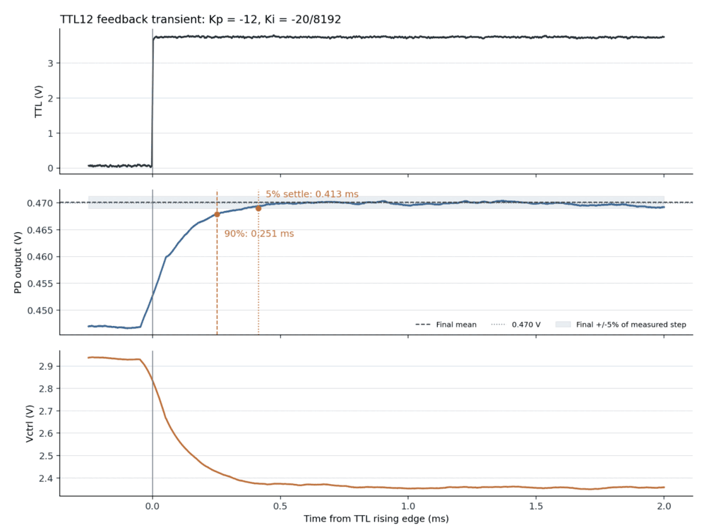
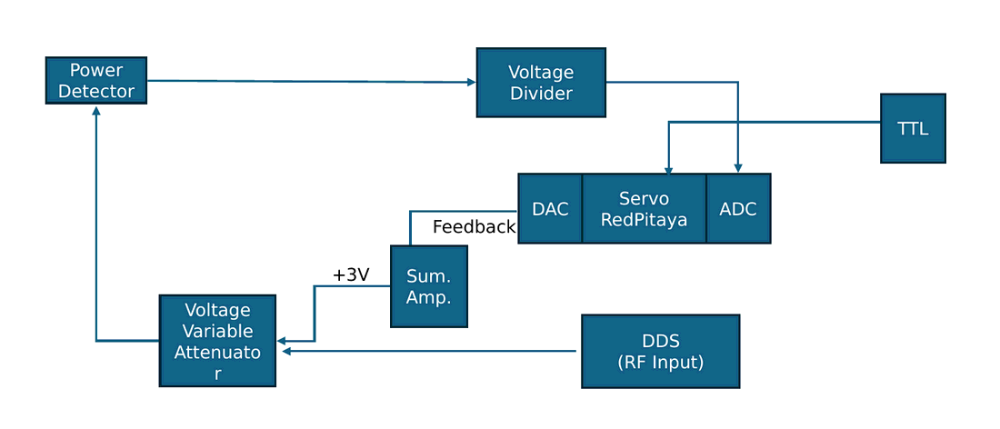
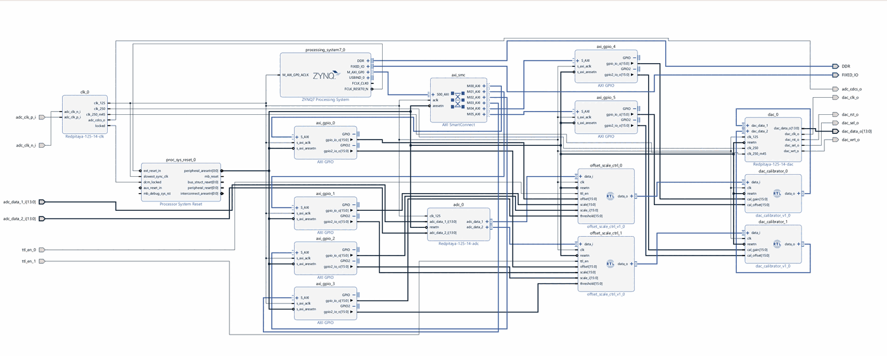
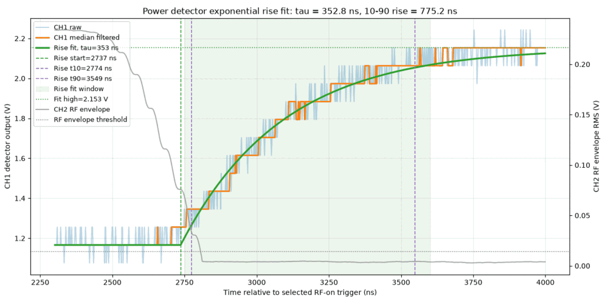

# RF Power Feedback Lock — Red Pitaya STEMlab 125-14

An FPGA PI servo that holds the output of an RF power detector at a setpoint by driving a voltage-variable attenuator. Verilog on the Zynq-7010 of a Red Pitaya STEMlab 125-14, with a root-owned Python runtime for parameter control.

Built at the QuETI Lab (Quantum Engineering with Trapped Ions), Sungkyunkwan University.

---

## Result

Closed loop, TTL-gated, `Kp = -12`, `Ki = -20/8192`:

| | |
|---|---|
| 90% rise | 251 µs |
| 5% settling | 413 µs |
| Measured step at detector | 22.6 mV |
| Residual setpoint offset | 17 mV |



The speed limit is the ~1 µs of transport delay around VVA → RF path → power detector, not the controller. At `Kp = -30` the loop rings at ~160 kHz before settling: the control voltage moves first, the detector answers roughly 1 µs later, and by then the controller has already overshot the correction it needed.

## Signal chain



RF power up → detector voltage down → controller raises attenuation → RF power back to setpoint. The summing amplifier maps the Red Pitaya's ±1 V output onto the VVA's 2–4 V control range.

## FPGA

125 MHz, 8 ns period. The PI datapath is split across five registered stages:

| Stage | |
|---|---|
| S1 | input capture, `error = setpoint − ADC`, threshold gate |
| S2 | P and I multiply |
| S3 | multiplier output register |
| S4 | P scale and saturate, I accumulate |
| S5 | P + I sum, final saturation |

Four clock cycles (32 ns) from input capture to output edge.



An earlier version did the subtraction, multiply, scaling, saturation and addition inside a single cycle and failed timing at **WNS −6.881 ns with 188 setup violations**. Repartitioning into the pipeline above closes at **WNS +1.213 ns, WHS +0.048 ns**.

Gains are fixed point in two different formats — `Kp` is Q6.10 (±32, step ≈0.00098), `Ki` is Q3.13 (±4, step ≈0.00012). The service rejects clients using the older Q3.13 `Kp` encoding, which would otherwise apply a gain 8× larger than intended.

ADC and DAC samples are corrected against the board's factory EEPROM gain/offset on either side of the controller, so setpoints are entered as volts at the input connector. Before this the custom FPGA path bypassed factory DAC calibration and read 100–150 mV high.

## Runtime

A root systemd service owns the bitstream and MMIO and exposes a Unix socket. Unprivileged user code talks to it through `rf_power_lock_control.py`:

```python
from rf_power_lock_control import apply, off, status

apply(channel=1, setpoint_volts=0.45, kp=-12.0, ki=-20/8192)
status()
off()   # reloads the bitstream, clearing the integrator
```

On boot the service loads the bitstream, validates and applies EEPROM calibration, and starts with setpoint, gains and threshold all at zero — so a power cycle never resumes a lock unattended.

## Component characterization

Measured before closing the loop, since these set the achievable loop bandwidth:

| Device | | |
|---|---|---|
| Power detector ZX47-40LN-S+ | 10–90% rise | 775 ns |
| | 90–10% fall | 709 ns |
| VVA ZX73-2500+ | 90–10% fall, 8 Vpp control | 1.57 µs |



Rise and fall times are exponential fits (`scipy.optimize.curve_fit`) to median-filtered scope traces rather than cursor readings.

## Repository map

Hand-written sources:

| Path | |
|---|---|
| `RF_Power_Lock_FINAL/analog_echo.srcs/sources_1/imports/hdl/offset_ctrl.v` | PI controller — pipeline, saturation, threshold gate |
| `.../imports/hdl/adc_calibrator.v` | ADC offset removal, gain, signed saturation |
| `.../imports/hdl/dac_calibrator.v` | DAC gain/offset correction and clamping |
| `RF_Power_Lock_FINAL/deploy/rf_power_lock_service.py` | root service — bitstream load, EEPROM, MMIO, socket |
| `RF_Power_Lock_FINAL/deploy/rf_power_lock_control.py` | user-facing control API |
| `RF_Power_Lock_FINAL/deploy/redpitaya_eeprom.py` | EEPROM calibration reader |
| `RF_Power_Lock_FINAL/PROJECT_HANDOFF.md` | full hardware, control and experiment writeup |

Also in `RF_Power_Lock_FINAL/`: `output/` is the bitstream and hardware handoff actually running on the board (SHA-256 recorded in `DEPLOYED_ARTIFACTS.sha256`), `verification/` is simulation sources and timing reports, `reports/` is Vivado output. Everything under `analog_echo.ipdefs/` and `analog_echo.srcs/sources_1/bd/` is Vivado-generated IP and block design, committed so the build reproduces.

The `analog_echo` files at the repository root are the earlier iteration of the project, kept as a record.

## Verification

- Behavioral pipeline simulation: 21/21 checks
- ADC calibration simulation: 8/8 checks
- Deployed bitstream SHA-256 matched against the local build artifact

## Open items

- Find the working `Kp`/`Ki` pair — `Kp = -12` is stable but not optimized
- Explain the 17 mV offset between setpoint and lock point
- Test pulse trains on the TTL gate to check for integrator wind-up across bursts
- FPGA exposes no ADC readback register; live detector values come from a scope
